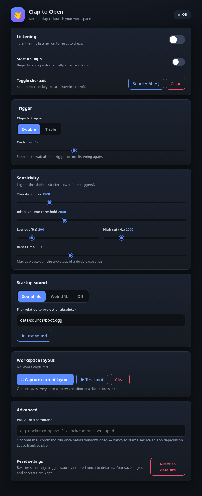

# Clap to Open 👏

**Double-clap into your mic and your whole workspace springs to life** — every
app relaunched and snapped back to the exact window position, size and monitor
it had when you saved it, with an optional startup sound. Everything is
configured from a small local **web control panel** — no config files to edit.

[](https://github.com/Forrest404/clap-to-open/actions/workflows/ci.yml)
[](LICENSE)
%20%7C%20Windows-informational)



---

## Install

### Linux (GNOME / Wayland)

One command — clones the repo and sets everything up:

```bash
curl -fsSL https://raw.githubusercontent.com/Forrest404/clap-to-open/main/scripts/bootstrap.sh | bash
```

Or do it by hand:

```bash
git clone https://github.com/Forrest404/clap-to-open.git
cd clap-to-open
./scripts/install.sh
```

The installer creates a self-contained virtualenv inside the project, installs
the package, registers a **systemd user service** for the clap listener, and
adds a *Clap to Open* application launcher. It’s safe to re-run.

> **Heads-up:** window placement uses the GNOME **window-calls** extension. If
> you don’t have it, the installer points you to it — it’s a one-click install
> from [extensions.gnome.org](https://extensions.gnome.org/extension/4724/window-calls/).

### Windows 10 / 11

In PowerShell:

```powershell
irm https://raw.githubusercontent.com/Forrest404/clap-to-open/main/scripts/bootstrap.ps1 | iex
```

Or by hand:

```powershell
git clone https://github.com/Forrest404/clap-to-open.git
cd clap-to-open
powershell -ExecutionPolicy Bypass -File scripts\install.ps1
```

This creates the venv, installs the package (+ `pywin32`/`psutil`), and adds a
Start-Menu shortcut. Window placement uses the Win32 API directly (no extension
needed); the listener runs as a background `pythonw` process, autostart is a
Startup-folder shortcut, and the global hotkey is registered by a small agent.

> **Windows status:** the Windows backend is authored and CI-tested for
> install/import, but window placement, sound, autostart and the global hotkey
> have not yet been exercised on a real Windows desktop — please
> [open an issue](https://github.com/Forrest404/clap-to-open/issues) if
> something misbehaves.

### Install with an AI agent

Not comfortable with a terminal? Paste this prompt into an AI coding agent
(Claude Code, Cursor, Copilot CLI, etc.) and let it do the install for you:

```text
Install the "Clap to Open" app from https://github.com/Forrest404/clap-to-open
on my machine. It's a Linux tool for GNOME on Wayland that lets me double-clap
to relaunch a saved window layout, configured from a local web control panel.

Please:
1. Confirm I'm on Linux running GNOME on Wayland (check $XDG_SESSION_TYPE and
   $XDG_CURRENT_DESKTOP). If not, warn me — this tool targets GNOME/Wayland.
2. Make sure the GNOME "window-calls" extension is installed and enabled
   (gnome-extensions list | grep window-calls). If it's missing, tell me to
   install it from https://extensions.gnome.org/extension/4724/window-calls/
   and enable it before continuing.
3. Run the installer:
   curl -fsSL https://raw.githubusercontent.com/Forrest404/clap-to-open/main/scripts/bootstrap.sh | bash
   It clones to ~/.local/share/clap-to-open, creates a venv, and registers a
   systemd user service + app launcher. If it asks to install PortAudio (needed
   by the mic library) or a sound player, approve that.
4. When it finishes, open the control panel by running:
   ~/.local/share/clap-to-open/venv/bin/clap serve
   then tell me to capture my current window layout, tune the clap sensitivity,
   and switch "Listening" on.
5. Report any errors and how you resolved them.
```

## Quick start

```bash
clap serve        # open the control panel at http://localhost:7333
```

(If `clap` isn’t on your PATH, use `./venv/bin/clap` or add `./venv/bin` to PATH.)

On first launch a **setup wizard** walks you through it: a live system check →
capture your layout → turn on listening and clap to test. That's it. (You can
re-run the checks any time with `clap doctor`.)

Doing it by hand instead:

1. Arrange your windows exactly how you like them.
2. In the panel, hit **Capture current layout**.
3. Tune sensitivity and pick double- or triple-clap.
4. Flip **Listening** on — now clap. 👏👏

## Features

- 🧭 **First-run onboarding wizard** — guided setup with a live system check.
- 🎛️ **Web control panel** — tune everything in the browser, nothing hardcoded.
- 🔊 **Listening + start-on-login** toggles with a live status indicator.
- ⌨️ **Custom global shortcut** — set your own hotkey to toggle listening.
- 👏 **Double or triple clap** to trigger, with an adjustable cooldown.
- 🎚️ **Sensitivity controls** — threshold, volume gate, band-pass, reset time.
- 🪟 **Workspace layouts** — capture the current windows, test the boot, clear.
- 🎵 **Startup sound** — a bundled chime (offline), any web URL, or off.
- ⚙️ **Pre-launch command** — optionally start a service your apps depend on.
- ♻️ **Reset to defaults** in one click.
- 📦 **Self-contained** — venv, config, layout and sounds all live in the folder.

## Privacy

**Your audio never leaves your machine.** The mic is used *only* to detect
claps, analysed in real time by the local `clap-detector` library and
immediately discarded:

- 🔒 **No recording** to disk, **no network**, no cloud, no telemetry.
- 🎚️ The listener is **off by default** — you turn it on (panel toggle or
  `clap ctl on`); it isn't auto-enabled at install.
- 👀 Open source — read exactly what it does in
  [`listener.py`](src/clap_to_open/listener.py). See [SECURITY.md](SECURITY.md).

## Command line

```bash
clap serve [--port N] [--no-open]   # web control panel
clap ctl on | off | toggle | status # control the listener
clap save                           # capture the current window layout
clap boot                           # replay the saved layout now
clap doctor                         # diagnose your setup (run this if stuck)
```

Bind a GNOME keyboard shortcut to `clap ctl toggle` for hands-free on/off.

## How it works

```
 mic ── listener ──(N claps)──▶ boot ──▶ relaunch saved apps
        (clap-detector)                  + window-calls MoveResize
                                         + optional startup sound
   ▲                                        ▲
   └──────────── config.json ───────────────┘
                     ▲
        web control panel (Flask) ── systemctl --user ──▶ listener service
```

`config.json` is the single source of truth, read by both the listener and the
boot sequence. The web UI writes it and restarts the listener so changes apply
immediately. `layout.json` stores captured window geometry/launch commands.

## Requirements

**Linux:**
- **GNOME on Wayland** (e.g. Fedora, Ubuntu) with the
  [**window-calls**](https://extensions.gnome.org/extension/4724/window-calls/)
  extension enabled.
- **Python 3.9+** and a C toolchain / PortAudio for the `clap-detector` mic
  library (the installer offers to install PortAudio for you on
  dnf/apt/pacman/zypper systems).
- `paplay` **or** `ffplay` for the local startup sound.

**Windows 10/11:**
- **Python 3.9+** (PyAudio installs from a prebuilt wheel — no compiler needed).
- `git` (for the one-line installer). `pywin32` + `psutil` are installed
  automatically. Sound plays via the built-in Windows MCI API.

## Troubleshooting

- **Claps don’t trigger / trigger too easily** — adjust *Threshold bias* in the
  panel (higher = stricter). Check the listener log:
  `journalctl --user -u clap-to-open.service -f`.
- **Windows open but don’t move** — confirm the window-calls extension is
  enabled (`gnome-extensions list | grep window-calls`).
- **No sound** — install `pipewire-utils`/`pulseaudio-utils` (`paplay`) or
  `ffmpeg` (`ffplay`), or set the sound mode to *Off*.
- **A captured app won’t relaunch** — some Flatpak/sandboxed apps record a
  command that can’t be replayed verbatim; launch those manually.

## Uninstall

```bash
./scripts/uninstall.sh     # removes the service + launcher; keeps your files
```

Delete the project folder to remove everything.

## License

[MIT](LICENSE) © Forrest404
